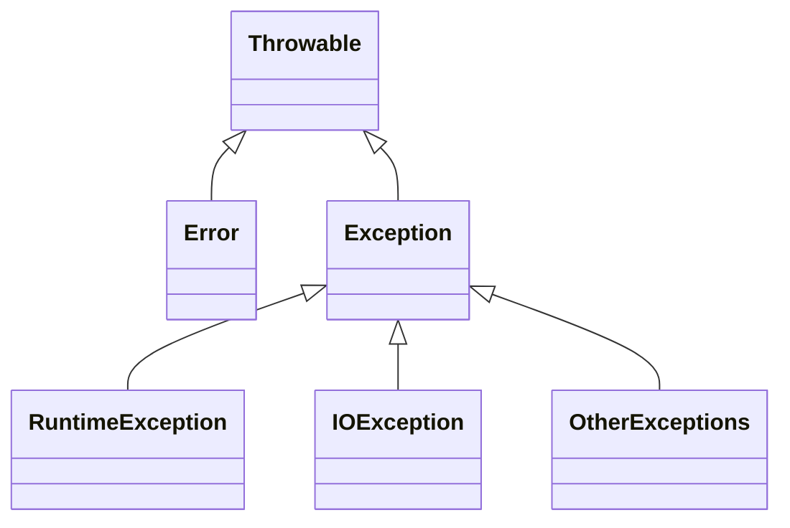

异常包括：**抛出异常**和**捕获异常**
抛出异常分为显示抛出异常和隐式抛出异常，其中**显示抛出异常**指的是在程序中使用“throw”关键字手动抛出异常，而**隐式抛出异常**指的是Java虚拟机在执行过程中，碰到无法继续执行的异常状态，自动抛出异常

捕获异常涉及到try、catch以及finally三大代码块：
- try代码块：用来标记需要进行异常监控的代码
- catch代码块：
  - 紧跟在try代码块后面，用于声明异常类型并设置异常类型处理器
  - try代码块后面可以匹配多个catch代码块
  - 前面的catch代码块所捕获的异常类型不能覆盖后面的
- finally代码块：位于catch代码块后面，它的设计初衷是为了避免跳过某些关键的清理代码，例如关闭已打开的系统资源

<!--more-->

#### 异常的基本概念

Java中，所有的异常都是Throwable类或其子类的实例，下面是Throwable的部分类图，可以看到它有两大子类：Error（包含程序不应捕获的异常，当程序触发Error时，它的执行状态已无法恢复，需要中断线程甚至是中止虚拟机），Exception(包含程序可能需要捕获并且处理的异常)。



Exception有一个特殊的子类RuntimeException，表示“程序虽然无法继续执行，但是还能抢救一下”，例如数组索引越界

非检查异常（unchecked exception）:包括RuntimeException和Error

检查异常（checked exception）：除RuntimeException和Error之外的异常

java中所有的检查异常都需要程序显示地捕获，或者在方法声明中用throws关键字标注

#### Java虚拟机是如何捕获异常的？

每一个包含try-catch代码块的方法，编译成字节码后，会有一个异常表(Exception table)，示例如下所示：

| from |  to  | target |           type            |
| :--: | :--: | :----: | :-----------------------: |
|  0   |  3   |   6    | Class java/lang/Exception |
| ...  | ...  |  ...   |            ...            |

对表的解释如下：

- 从第二行起，表的每一行称为一个条目，代表一个异常处理器

- from指针和to指针：

  - 指针的值是字节码索引（bytecode index,bci），用以定位字节码

  - 标示了该异常处理器所监控的范围，例如try代码块所覆盖的范围

- target指针：指向异常处理器的起始位置，例如catch代码块的起始位置

- type:所捕获异常的类型

java虚拟机面对异常工作流程：


如果catch代码块捕获了异常，并且触发了另一个异常，那么finally捕获并且重抛的异常是catch代码块触发的另一个异常，即try代码块抛出的异常会被忽略掉，java7中引入了Suppressed异常来解决这个问题，Suppressed异常允许抛出的异常可以附带多个异常的信息

try-with-resources: 在java 7 引入，主要目的是精简资源打开关闭的用法

java 7 之前，每一个资源都要对应一个独立的try-finally代码块，以保证每个资源都能够关闭，示例：

```java

  FileInputStream in0 = null;
  FileInputStream in1 = null;
  FileInputStream in2 = null;
  ...
  try {
    in0 = new FileInputStream(new File("in0.txt"));
    ...
    try {
      in1 = new FileInputStream(new File("in1.txt"));
      ...
      try {
        in2 = new FileInputStream(new File("in2.txt"));
        ...
      } finally {
        if (in2 != null) in2.close();
      }
    } finally {
      if (in1 != null) in1.close();
    }
  } finally {
    if (in0 != null) in0.close();
  }

```

try-with-resources简化了资源打开关闭的方式，示例：

```java
//Foo类实现AutoCloseable接口
public class Foo implements AutoCloseable {
  private final String name;
  public Foo(String name) { this.name = name; }

  @Override
  public void close() {
    throw new RuntimeException(name);
  }

  public static void main(String[] args) {
    try (Foo foo0 = new Foo("Foo0"); // try-with-resources
         Foo foo1 = new Foo("Foo1");
         Foo foo2 = new Foo("Foo2")) {
      throw new RuntimeException("Initial");
    }
  }
}

// 运行结果：
Exception in thread "main" java.lang.RuntimeException: Initial
        at Foo.main(Foo.java:18)
        Suppressed: java.lang.RuntimeException: Foo2
                at Foo.close(Foo.java:13)
                at Foo.main(Foo.java:19)
        Suppressed: java.lang.RuntimeException: Foo1
                at Foo.close(Foo.java:13)
                at Foo.main(Foo.java:19)
        Suppressed: java.lang.RuntimeException: Foo0
                at Foo.close(Foo.java:13)
                at Foo.main(Foo.java:19)

```

java 7 支持在同一个catch代码块中捕获多个异常：

```java

// 在同一catch代码块中捕获多种异常
try {
  ...
} catch (SomeException | OtherException e) {
  ...
}
```


