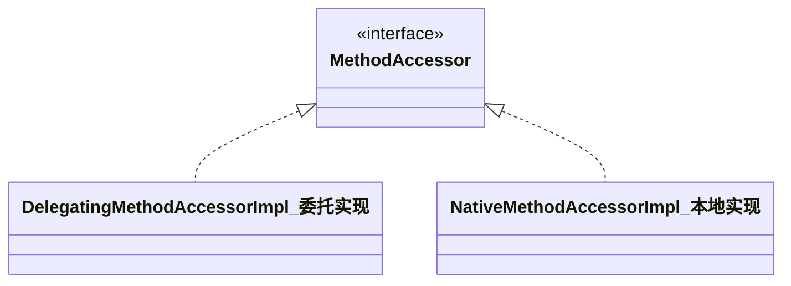

> **反射式编程**（英语：reflective programming）或**反射**（英语：reflection），是指[计算机程序](https://zh.wikipedia.org/wiki/计算机程序)在[运行时](https://zh.wikipedia.org/wiki/运行时)（runtime）可以访问、检测和修改它本身状态或行为的一种能力。**反射就是程序在运行的时候能够观察并且修改自己的行为**--维基百科

反射的应用场景：

- 集成开发环境（IDE）使用了反射机制，例如在IDEA中，每当我们敲入点号时，IDEA便会根据点号前的内容，动态展示可以访问的字段或者方法
- 调试器使用了反射机制，能够在调试过程中枚举某一对象所有字段的值
- Spring中的IOC（inversion of control）控制反转，使用了反射机制
  
<!--more-->

#### 反射调用的实现

Method.invoke（方法的反射调用）源码分析：



方法反射调用委派给了MethodAccessor接口来处理，通过该接口的本地实现和委托实现两个类来实现方法的反射调用

反射调用到目标方法的栈轨迹：Method.invoke→DelegatingMethodAccessorImpl.invoke→NativeMethodAccessorImpl.invoke→Native Method，示例如下：

```java
import java.lang.reflect.Method;

public class Test {
    public static void target(int i) {
        //打印反射调用的栈轨迹
        new Exception("#" + i).printStackTrace();
    }

    public static void main(String[] args) throws Exception {
        Class<?> klass = Class.forName("Test");
        Method method = klass.getMethod("target", int.class);
        method.invoke(null, 0);
    }
}
//命令行输入和输出
    PS D:\leetcode\src\main\java\com\li\leetcode> javac Test.java
        PS D:\leetcode\src\main\java\com\li\leetcode> java Test
        java.lang.Exception: #0
        at Test.target(Test.java:11)
        at sun.reflect.NativeMethodAccessorImpl.invoke0(Native Method)
        at sun.reflect.NativeMethodAccessorImpl.invoke(Unknown Source)
        at sun.reflect.DelegatingMethodAccessorImpl.invoke(Unknown Source)
        at java.lang.reflect.Method.invoke(Unknown Source)
        at Test.main(Test.java:17)
        PS D:\leetcode\src\main\java\com\li\leetcode>
```

动态实现：Java反射调用机制设立了一种动态生成字节码的实现，即直接使用invoke指令来调用目标方法

反射调用采用委托实现作为中间层是为了能够在本地实现和动态实现中切换

动态实现无需经过Java→C++→Java的切换，运行效率比本地实现快上20倍，但是生成字节码十分耗时，如果仅调用一次，反而是本地实现要快上3到4倍

jvm设置了一个阈值15（#15，从0开始编号），当反射调用次数在#15及以下时（16次及以下时），采用本地实现；而当反射调用次数在#15以上时（从#16开始，17次以上时），采用动态实现，这个过程称之为Inflation;示例如下：

```java
import java.lang.reflect.Method;

public class Test {
    public static void target(int i) {
        new Exception("#" + i).printStackTrace();
    }

    public static void main(String[] args) throws Exception {
        Class<?> klass = Class.forName("Test");
        Method method = klass.getMethod("target", int.class);
        //反射调用20次
        for (int i = 0; i < 20; i++) {
            method.invoke(null, i);
        }
    }
}
//命令行输入和输出：
//1.执行java Test.java
//2.执行java -verbose:class Test
java.lang.Exception: #0
        at Test.target(Test.java:12)
        at sun.reflect.NativeMethodAccessorImpl.invoke0(Native Method)
        at sun.reflect.NativeMethodAccessorImpl.invoke(Unknown Source)
        at sun.reflect.DelegatingMethodAccessorImpl.invoke(Unknown Source)
        at java.lang.reflect.Method.invoke(Unknown Source)
        at Test.main(Test.java:19)
java.lang.Exception: #1
        at Test.target(Test.java:12)
        at sun.reflect.NativeMethodAccessorImpl.invoke0(Native Method)
        at sun.reflect.NativeMethodAccessorImpl.invoke(Unknown Source)
        at sun.reflect.DelegatingMethodAccessorImpl.invoke(Unknown Source)
        at java.lang.reflect.Method.invoke(Unknown Source)
        at Test.main(Test.java:19)
...
java.lang.Exception: #15
        at Test.target(Test.java:12)
        at sun.reflect.NativeMethodAccessorImpl.invoke0(Native Method)
        at sun.reflect.NativeMethodAccessorImpl.invoke(Unknown Source)
        at sun.reflect.DelegatingMethodAccessorImpl.invoke(Unknown Source)
        at java.lang.reflect.Method.invoke(Unknown Source)
        at Test.main(Test.java:19)
[Loaded java.util.concurrent.ConcurrentHashMap$ForwardingNode from D:\Environment\jre1.8\lib\rt.jar]
java.lang.Exception: #16
        at Test.target(Test.java:12)
        at sun.reflect.GeneratedMethodAccessor1.invoke(Unknown Source)
        at sun.reflect.DelegatingMethodAccessorImpl.invoke(Unknown Source)
        at java.lang.reflect.Method.invoke(Unknown Source)
        at Test.main(Test.java:19)
java.lang.Exception: #17
        at Test.target(Test.java:12)
        at sun.reflect.GeneratedMethodAccessor1.invoke(Unknown Source)
        at sun.reflect.DelegatingMethodAccessorImpl.invoke(Unknown Source)
        at java.lang.reflect.Method.invoke(Unknown Source)
        at Test.main(Test.java:19)
java.lang.Exception: #18
        at Test.target(Test.java:12)
        at sun.reflect.GeneratedMethodAccessor1.invoke(Unknown Source)
        at sun.reflect.DelegatingMethodAccessorImpl.invoke(Unknown Source)
        at java.lang.reflect.Method.invoke(Unknown Source)
        at Test.main(Test.java:19)
java.lang.Exception: #19
        at Test.target(Test.java:12)
        at sun.reflect.GeneratedMethodAccessor1.invoke(Unknown Source)
        at sun.reflect.DelegatingMethodAccessorImpl.invoke(Unknown Source)
        at java.lang.reflect.Method.invoke(Unknown Source)
        at Test.main(Test.java:19)
[Loaded java.lang.Shutdown from D:\Environment\jre1.8\lib\rt.jar]
[Loaded java.lang.Shutdown$Lock from D:\Environment\jre1.8\lib\rt.jar]
```

#### 反射调用的开销

方法反射调用的步骤：Class.forName()→Class.getMethod()→Method.invoke()

- Class.forName():获取Class对象，会调用本地方法；Class.getMethod()会遍历该类的公有方法，如果未匹配，还将遍历父类的公有方法，它会返回查找得到结果的一份拷贝
- Class.forName()和Class.getMethod()这两步非常耗时

反射调用带来的性能开销的主要原因：

- 变长参数方法导致Java编译器会在该方法调用处生成一个长度为传入参数数量的Object数组，并将传入参数一一存储进该数组中
- 基本类型的自动拆箱和装箱
- 方法内联

#### 获取Class对象的方式
使用反射的第一步是获取Class对象，常见的有以下三种方式：
   - Class.forName()
   - getClass()方法
   - 类名＋".class"


